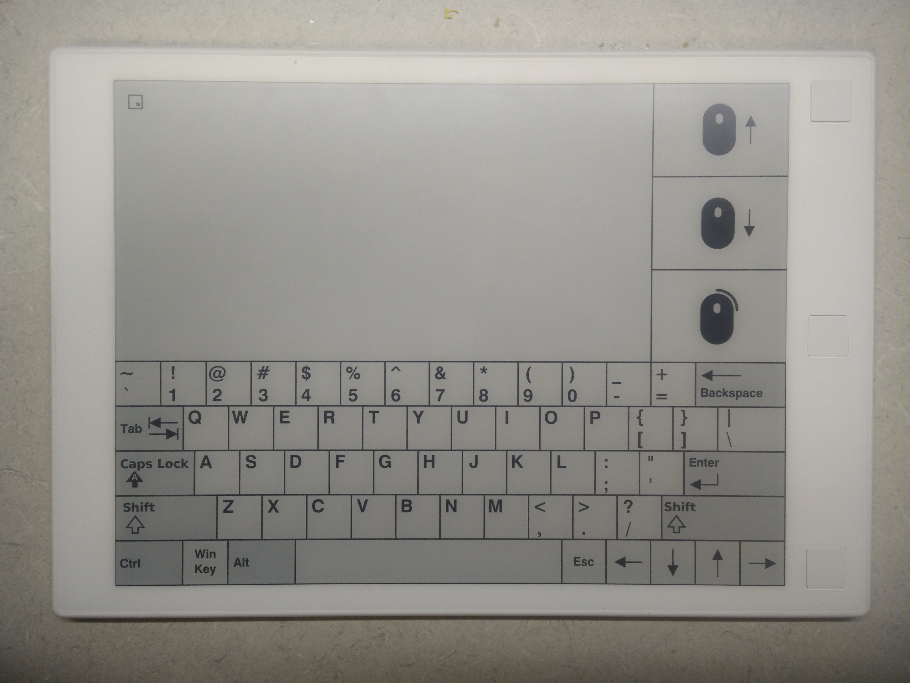

# remarkable_keyboard

Use your reMarkable as a wireless mouse and keyboard.



# Usage

Copy [this pdf](resources/keyboard.pdf) to your device.

``` bash
pip install remarkable-keyboard
rekeyboard
```

By default, `10.11.99.1` is used as the address.

# Examples

``` bash
# specify address, password (listed under Settings > About)
rekeyboard --address 192.168.1.100 --password PASSWORD

# pubkey login
ssh-keygen -f ~/.ssh/remarkable -N ''
ssh-copy-id -i ~/.ssh/remarkable.pub root@10.11.99.1
rekeyboard --key ~/.ssh/remarkable
```
